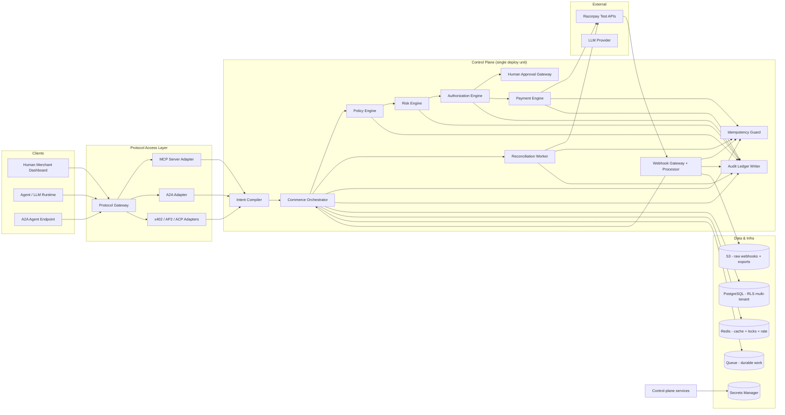

# AegisPay — Master Architecture

> **The Trust & Growth Layer for Agentic Commerce**
> Version 1.1 · Production-grade design · Razorpay Test Mode first

This document is the canonical, self-contained answer to the AegisPay architecture
brief. It follows the exact 52-part output order of the brief. Deep detail for any
section lives in the corresponding numbered file under `docs/`. Here each section
gives the decision, the reasons, the alternatives rejected, and the trade-offs.

> **Product model:** AegisPay delivers three pillars — **GROW** (AI revenue),
> **SELL** (AI-transactable merchants), **PROTECT** (bounded, safe, auditable money).
> The engineering that makes all three safe is the separation of AI reasoning from
> financial execution. Strategy framing: `docs/00b-grow-sell-protect.md`.

---

## 1. Executive Summary

Agentic commerce is real: LLM-backed agents can already discover products, build
carts, and invoke payment APIs. The failure mode is a category error — LLMs are
**probabilistic**, payment APIs are **deterministic**, and financial action requires
**authorization, auditability, and deterministic safety**.

AegisPay is not a payment gateway. It is a **control plane** that owns the hard
invariant:

> **AI may propose a financial action. Only the deterministic AegisPay control
> plane may authorize and execute it.**

The design enforces this with five structural mechanisms, not with model alignment:

1. **Intent compilation** — free-form agent reasoning is compiled into a structured,
   validated commerce intent (typed, schema'd, tenant-bound, hashed).
2. **Deterministic policy engine** — a versioned, DSL-driven engine that yields
   `ALLOW / DENY / HUMAN_APPROVAL_REQUIRED / STEP_UP_AUTHENTICATION` from facts,
   not from probability.
3. **Explainable risk engine** — deterministic rules + statistical risk + an ML
   model, with the LLM explicitly **excluded** as final authority.
4. **Transaction Passport** — a hash-chained, signed record binding intent → cart →
   policy → risk → authorization → provider → outcome, providing provenance,
   non-repudiation, and replay protection.
5. **Provider adapter + webhook + reconciliation** — Razorpay is a swappable
   adapter; provider truth flows only through verified webhooks and reconciliation,
   never through the agent or frontend.

The result: an architecture a senior Razorpay engineer can read and conclude that the
team **understands why agentic AI and financial infrastructure must be separated**.
It is deliberately boring where boring is safe (PostgreSQL, Redis, one queue, a
modular monolith) and deliberately adversarial where it must be (policy, risk,
authorization, audit).

---

## 2. Product Scope

AegisPay lets AI agents do the *thinking and proposal* side of commerce:

- Discover merchant catalogs, understand products, recommend products, build carts,
  upsell/cross-sell, generate campaigns, initiate transactions, request
  authorization, and trigger payment — **but always through a controlled gateway**.

AegisPay owns the *authorization and execution* side:

- Policy evaluation, risk evaluation, human-in-the-loop approval, payment execution
  via provider, failure handling, reconciliation, and a complete audit trail.

**Out of scope (at v1, on purpose):** becoming a wallet, issuing cards, direct
banking integration (NPCI), complex payment routing, multi-currency settlement,
credit/lending, and representing itself as a licensed PSP. AegisPay delegates money
movement to Razorpay; AegisPay is the **control layer** above it.

---

## 3. Functional Requirements

Key requirements (full list in `docs/01-product-requirements.md`):

- **FR-1 Agent discovery** — agent can search catalog, read product, compare.
- **FR-2 Intent capture** — agent converts user intent to a structured intent object.
- **FR-3 Cart management** — create/modify/lock cart; cart is server-authoritative.
- **FR-4 Authorization requests** — agent requests authorization for a cart+intent.
- **FR-5 Policy enforcement** — every money action passes the policy engine.
- **FR-6 Risk evaluation** — explainable risk score with human-readable factors.
- **FR-7 Human-in-the-loop** — high-risk actions escalate to approval inbox.
- **FR-8 Payment execution** — provider-abstracted create-order/initiate/capture/refund.
- **FR-9 Webhook pipeline** — verified, deduplicated, replay-proof ingestion.
- **FR-10 Reconciliation** — resolve UNKNOWN states via provider lookup, no blind retry.
- **FR-11 Transaction Passport** — retrieve the signed provenance bundle per transaction.
- **FR-12 Audit ledger** — append-only, hash-chained, inspectable event trail.
- **FR-13 Growth agent** — recommendations/campaigns that still flow through policy.
- **FR-14 Protocol interoperability** — MCP/A2A/x402 adapters over a canonical model.

---

## 4. Non-Functional Requirements

| NFR | Requirement | Target / constraint |
|---|---|---|
| Correctness | No double charge ever; unknown ⇒ block | Idempotency + state machine + reconciliation |
| Security | LLM cannot move money; no secrets to LLM | Tool allowlist, deterministic policy, sealed keys |
| Reliability | Provider/DB/queue failure ⇒ fail safely | Circuit breakers, DLQ, reconciliation, degraded-but-safe mode |
| Explainability | Every decision traceable to inputs | Policy/reason trail + Transaction Passport |
| Availability | Publish realistic, honest target | ~99.9% phase 1; documented degradation modes |
| Latency | p95 targets for each link (policy <50ms, risk <100ms, payment <2s) | Profiled; cached policy/risk where safe |
| Auditability | Every financial event recorded, tamper-evident | Append-only + hash chain + signature |
| Scalability | Multitenant, horizontal for stateless services | Shared-schema + RLS, stateless APIs, worker pools |
| Durability | Daily PITR backups, multi-AZ, documented RPO/RTO | RPO ≤ 15 min, RTO ≤ 1 hr (see §37) |
| Privacy | Data minimization, PII redaction, retention | Field-level encryption, retention policies |

---

## 5. Architecture Principles

1. **Financial actions are deterministic.**
2. **LLM output is untrusted input** — validate, type, confine.
3. **Authorization must be explicit** — a money action needs a signed precursor.
4. **Policies must be deterministic and versioned** — immutable, rollback-able.
5. **Money actions must be idempotent.**
6. **Payment state comes from backend/provider truth.**
7. **Webhooks are untrusted external events.**
8. **Fail closed for financial authorization.**
9. **Never blindly retry unknown payments** — reconcile.
10. **Minimize PII.**
11. **Every financial action is auditable.**
12. **Separate reasoning from execution.**
13. **Separate protocol adapters from core business logic.**
14. **Avoid unnecessary microservices.**
15. **Prefer boring, reliable infrastructure.**
16. **Every external dependency needs timeout/retry/failure handling.**
17. **Every security boundary must be explicit.**
18. **Never claim protocol/regulatory compliance without evidence.**
19. **Design for test mode first.**
20. **Production readiness demonstrated by failure/attack tests**, not diagrams.

---

## 6. System Architecture



**Reading it.** The protocol layer is optional skins; the control plane is one logic
domain; data lives in a multitenant PostgreSQL (RLS), Redis for cache/locks/rate,
and one durable queue for async work. Razorpay is the only money-movement sink, and
the only path provider state enters is via the verified webhook + reconciliation
workers. The LLM is upstream of the intent compiler and has **no** edge to money.

---

## 7. Component Architecture

| Component | Purpose | Burdens it owns | Key failure mode |
|---|---|---|---|
| Intent Compiler | Convert agent/LLM output into a validated, hashable `CommerceIntent` | Validation, typing, hashing, tenant binding | Malformed intent => reject, never guess |
| Commerce Orchestrator | The aggregate of the purchase journey; owns intent/cart/order lifecycle | State transitions, guards, event emission | Inconsistent state => guarded states |
| Policy Engine | Deterministic decision from facts + policy rules | DSL eval, precedence, versioning | Deny-on-uncertain |
| Risk Engine | Explainable score + factors | Rule + stat + model fusion | Escalate on uncertainty |
| Authorization Engine | Issue/bind transaction-bounded authorizations | Binding, expiry, hash, replay prevention | Never reuse expired/stale authz |
| Human Approval Gateway | Escalation inbox, approvals, expiry, decision | Non-reusable scoped approvals | Stale/scope-mismatched => reject |
| Payment Engine | Provider-abstract lifecycle | createOrder, capture, refund, verify | Timeout => UNKNOWN |
| Webhook Gateway | Verify sig, dedupe, persist raw, enqueue | Signature, timestamp, hash | Poison => DLQ |
| Reconciliation | Resolve UNKNOWN via provider lookup | Backoff, attempts, escalation | Still unknown => manual (deny, never double) |
| Audit Ledger | Append-only, hash-chained event writer | Tamper-evidence, event signature | Fail on integrity mismatch |
| Idempotency Guard | Request-keyed dedup across all money ops | Key+hash+TTL, DB unique constraint | Replay => return prior result |

---

## 8. Service Boundaries

**Decision: a single-language Python/FastAPI modular monolith** for the entire
backend, split into two deploy units for security, not for language reasons.
Full rationale in **ADR-002**.

- **One FastAPI service** (`control-plane`): HTTP API, policy, risk, authorization,
  HITL, payment engine, webhook processor, reconciliation workers, audit writer.
  These are **modules** with clean internal interfaces (separate Python packages),
  not separate deployment units.
- **One FastAPI service** (`ai-agent-runtime`): the only thing that talks to the LLM.
  It emits structured intents over an internal authenticated API. It has **no**
  database credentials, no Razorpay keys, no write access to money. The isolation is a
  **process + permission boundary**, not a language boundary.
- **One worker set** (FastAPI/asyncio): async jobs (reconciliation, outboxes,
  email/slack notifications, analytics rollups). Uses the same queue.

**Why not microservices?** At this stage a modular monolith is faster to build,
safer to operate, trivially transactional across the purchase journey, and avoids
distributed-transaction pain over the most sensitive state. The modules are
structured (interfaces + separate packages) so they can be lifted into services later
without a rewrite. The only true split is the AI-LLM boundary, which is forced by
security isolation (no keys, no DB, no money tools) and by the heavy AI tooling being
kept out of the hot money path.

**Sync vs async.**
- **Sync (in-request):** intent compile, policy, risk, authorization issuance,
  order/payment creation, human evaluation reads.
- **Async (queue):** provider state application from webhooks, reconciliation,
  notification, analytics, refund processing, campaign execution.

**Failure boundaries.** The control plane fails closed: if policy, risk, or
authorization is unavailable, no new money action is allowed. Payment calls are
made through a circuit breaker; a provider timeout produces `UNKNOWN`, never a
blind retry.

---

## 9. Data Architecture

- **Engine:** PostgreSQL 16+ (primary, transactional source of truth).
- **Tenancy:** shared database, shared schema, **Row-Level Security** + `tenant_id`
  on every table. Chosen because it keeps one operational plane, one backup, one
  migration path, and low cross-tenant complexity while still giving hard isolation.
  Comparison and rejection rationale in **§10** and **ADR-014**.
- **Encryption at rest:** AWS RDS KMS encryption for the whole DB; **field-level**
  encryption (application layer) for secrets, tokens, and high-sensitivity fields.
- **Cache/locks/rate:** Redis (ElastiCache) — never the source of truth.
- **Queue:** one durable queue (SQS or Kafka for larger-scale; see ADR-005).

See `docs/05-database-design.md` and `docs/06-data-dictionary.md`.

---

## 10. Database Schema

The tenancy decision:

| Option | Isolation | Ops complexity | Migration | Recommendation |
|---|---|---|---|---|
| Shared DB / shared schema | Weak (RI) but enforceable via RLS | Lowest | Simple | **Chosen** |
| Shared DB / separate schema | Medium | Medium | Harder (per-schema migrations) | Rejected |
| Database-per-tenant | Strong | High | Very hard | Rejected for v1 |

**Chosen:** shared schema + RLS. Reason: a single tenancy row on every table, `SET LOCAL app.tenant_id` per request, `USING (tenant_id = current_setting('app.tenant_id')::bigint)` policy on read/write. Feasible; provides hard isolation at the DB engine without an ops explosion. Analytics runs on read replicas with the same RLS.

**Entity tables** (each has `id`, `tenant_id`, `created_at`, `updated_at`, `deleted_at`, RLS policy, and the noted constraints/encryption):

- **merchants** — tenant owner. `id, tenant_id, name, slug, business_type, country, currency, status, default_autonomy_level, razorpay_key_id, kms_ref, created_at, updated_at, deleted_at`. PII control; KMS ref never stores the secret.
- **merchant_users** — a user belonging to a tenant; RBAC roles; password hash / OIDC subject; MFA. `email` encrypted.
- **agents** — identity. `id, tenant_id, agent_key, owner_user_id, agent_type, version, scopes(jsonb), allowed_tools(jsonb), trust_level, status, expires_at`. Status ∈ ACTIVE/SUSPENDED/REVOKED/EXPIRED. Unique `(tenant_id, agent_key)`.
- **agent_credentials** — scoped keys, hashed, with `last_used_at`, `revoked_at`; never plaintext.
- **agent_sessions** — session/IP, device, started/ended, revocation.
- **customers** — purchaser PII. `email`/`phone` encrypted; minimization enforced.
- **customer_authorizations** — the explicit user-to-agent spending mandate. `customer_id, agent_id, scope, upper_value_limit, per_txn_limit, valid_from, valid_to, status`, plus a `mandate_hash` (signed). Central to replay/authorization theft defense.
- **mandates** — the stored authorization object a transaction binds to.
- **products** — catalog items; `price` stored as minor units (`bigint` for paise), category, status, `indexed_name` for search.
- **catalogs** — tenant-owned grouping of products.
- **inventory** — per-SKU stock counts, `version` for optimistic locking (must never go negative without a guard).
- **carts** — `id, tenant_id, customer_id, agent_id, status, currency, cart_hash, expires_at`. `cart_hash` = hash of ordered line items; guards cart tampering.
- **cart_items** — `cart_id, product_id, quantity, unit_price, line_total, hash_component`. `unit_price` server-authoritative, never client-supplied.
- **commerce_intents** — compiled structured intent. `id, tenant_id, agent_id, user_id, kind, summary, raw_hash, intent_hash, status, expires_at`. `intent_hash` binds the exact proposal.
- **intent_items** — the typed line-item proposals belonging to the intent.
- **orders** — `id, tenant_id, cart_id, intent_id, customer_id, currency, total_minor, status, agent_id, policy_version, risk_score`. `status` machine enforced (see §11).
- **order_items** — the frozen order snapshot (name, unit_price, qty, line_total) — immutable once created; prevents price/tamper drift.
- **payments** — one per order capture path. `id, order_id, amount_minor, currency, provider, provider_payment_id, provider_order_id, capture_id, status, idempotency_key, attempt_count, unknown_since`. Never trusts frontend `status`.
- **payment_attempts** — append-only attempt log. `payment_id, attempt_no, provider_txn_id, request_hash, outcome, provider_response_hash, created_at`.
- **refunds** — `id, payment_id, amount_minor, reason, status, idempotency_key, provider_refund_id`. Refund safety: refund ≤ captured amount, one effective refund per idempotency key, all through policy.
- **policies** — tenant-owned policy set. `id, tenant_id, name, version, status, dsl, effective_at, supersedes`.
- **policy_versions** — immutable version history.
- **policy_rules** — the individual rules: `policy_id, rule_id, effect(ALLOW/DENY/REQUIRE_APPROVAL/REQUIRE_STEPUP), dimension(amount/category/hour/agent/velocity), operator, value, precedence, not_before`.
- **risk_assessments** — `id, tenant_id, target_type, target_id, score, level(LOW/MEDIUM/HIGH/CRITICAL), factors(jsonb), recommended_action, model_version, created_at`.
- **approval_requests** — `id, tenant_id, order_id, requested_by_agent_id, require_approver_role, amount, status, expires_at, scope_hash`. Scope-binding prevents substitution.
- **approval_decisions** — `id, approval_request_id, approver_user_id, decision(APPROVE/REJECT), reason, decision_hash, created_at`. Non-reusable: bound to a specific unscoped request + hash.
- **campaigns** — growth-agent output. `id, tenant_id, name, budget_minor, status, targeting(jsonb), discount_policy_ref, policy_version, risk_score`. Budget-capped, policy-reviewed.
- **campaign_actions** — the concrete actions (recommend, upsell, coupon) plus the resulting order references.
- **protocol_sessions** — canonical mapping of an external protocol session (MCP/A2A/x402) to internal identity.
- **audit_events** — append-only, hash-chained. `id, tenant_id, event_type, actor, actor_type, correlation_id, causation_id, trace_id, payload(jsonb), previous_hash, event_hash, event_signature, created_at`. RLS is read-only enforced for this table (no UPDATE/DELETE grants).
- **audit_event_hashes** — periodic anchor/checkpoint chain for tamper detection.
- **idempotency_keys** — `key, tenant_id, endpoint, request_hash, response, status, expires_at`; unique on `(tenant_id, endpoint, key)`.
- **webhook_events** — raw events, signature, provider, status, received_at, event_id. `unique(provider, provider_event_id)` for dedupe.
- **webhook_deliveries** — fan-out attempts, attempts_count, next_attempt_at, last_error.
- **reconciliation_jobs** — `id, payment_id, job_no, status, next_attempt_at, attempts, max_attempts, result, escalated`. Deterministic schedule; no blind retry.
- **notifications** — outbound (approval request, escalation) with delivery state.

**Indexes:** every table indexed on `(tenant_id, status)`, foreign-key columns, and the hot query columns (orders by tenant+status+created, payments by order_id, idempotency by composite key, webhooks by provider+event_id). Unique constraints enforce idempotency and one-active-request guarantees.

**Soft delete:** `deleted_at` on merchant-facing aggregates (products, catalogs, campaigns, customers). **Never** soft-delete: payments, audit_events, idempotency_keys, webhook_events — these are immutable for audit/tamper-evidence.

---

## 11. State Machines

`docs/32-state-machines.md` has diagrams; summary + legality here.

**Intent:** `CREATED → VALIDATED → AUTHORIZED → {EXPIRED|REJECTED}`.
Legal: VALIDATED→AUTHORIZED only if policy says allow/approve. Illegal: anything to
AUTHORIZED from REJECTED.

**Cart:** `CREATED → MODIFIED → LOCKED → CHECKOUT_READY → EXPIRED`. LOCKED is the
seal point — a cart hash is frozen at LOCKED and any subsequent item/price change
invalidates the hash (checkout must restart). Illegal: MODIFIED after LOCKED.

**Order:** `CREATED → AUTHORIZATION_PENDING → APPROVED → PAYMENT_PENDING → PAID →
COMPLETED`, with branches to `REJECTED`, `FAILED`, `CANCELLED`, `REFUND_PENDING`,
`REFUNDED`. Every transition is a guarded function; the transition table is in the
state-machine doc. Illegal: APPROVED→PAID without a provider-confirmed payment.

**Payment** (separate machine; never infer from frontend):
`CREATED → AUTHORIZATION_PENDING → CAPTURE_PENDING → CAPTURED (SUCCESS) | FAILED |
UNKNOWN`. UNKNOWN is a first-class state: only a webhook with a verified signature
or a reconciliation result moves it to SUCCESS/FAILED — **never** a blind retry.

**Legal vs illegal transitions** are governed by: (a) the state transition table
(unit-tested), (b) guard functions checking the passport (authz validity, scope,
expiry), (c) the idempotency guard, and (d) provider truth via webhook/reconciliation.

---

## 12. API Architecture

REST + OpenAPI 3.1 (see `api/openapi.yaml` and `docs/04-api-specification.md`).

Representative routes (full set in the spec):

- `POST /v1/merchants`, `POST /v1/agents`, `POST /v1/catalogs`
- `POST /v1/catalog/products` (prices in minor units, server-side)
- `POST /v1/intents`, `POST /v1/carts`, `POST /v1/carts/{id}/checkout`
- `POST /v1/authorization/requests`
- `POST /v1/approvals/{id}/approve`, `POST /v1/approvals/{id}/reject`
- `POST /v1/orders`, `GET /v1/orders/{id}`
- `POST /v1/payments`, `GET /v1/payments/{id}`
- `POST /v1/webhooks/razorpay`
- `GET /v1/audit/events`, `GET /v1/transactions/{id}/passport`

**Uniform contract.** Every mutating endpoint: `Idempotency-Key` header honoured,
request-hash computed, unique constraint on `(tenant, endpoint, key)`, standard error
envelope, tenant-scoped auth, per-endpoint rate limits, and an audit event.

**Auth:** server-to-server API keys (merchant/agent-scoped), OAuth/OIDC for users,
and internal mTLS / signed service identity. No key ever reaches the LLM.

---

## 13. Event Architecture

Domain events, versioned, emitted at state boundaries. Envelope in `docs/31-event-catalog.md`.

Event types include: `commerce.intent.created`, `commerce.cart.created`,
`commerce.order.created`, `payment.initiated`, `payment.succeeded`,
`payment.failed`, `payment.unknown`, `payment.reconciled`, `approval.requested`,
`approval.approved`, `approval.rejected`, `policy.denied`, `risk.escalated`.

**Envelope:** `event_id`, `event_type`, `schema_version`, `timestamp`, `tenant_id`,
`correlation_id`, `causation_id`, `payload`. Events are **also the audit events** —
the event stream and the audit ledger share a schema, so every business event is
automatically auditable. Versioning: additive (`schema_version`) with a documented
downstream upgrade policy.

**Transactional outbox:** events are written to an outbox table in the same transaction
as the state change they describe, then relayed to the queue. This means you can never
have a state change with a missing event ("committed but not emitted") or an event
without a state change ("emitted but not committed"), and consumers can safely be
at-least-once and idempotent.

---

## 14. Agent Architecture

- **Agent identity model** (`docs/09-agent-security.md`, `docs/19-mcp-a2a-integration.md`):
  `agent_key, owner, type, version, credential, scopes, allowed_tools, policy, trust_level, expires_at, status`.
  An agent can never elevate its own scopes or policy. Every agent action is
  rate-limited, tool-allowlisted, audited, and idempotent.
- **Tool layer:** safe tools (`search_catalog`, `get_product`, `create_cart`,
  `add_to_cart`, `calculate_total`, `request_checkout`, `request_authorization`,
  `request_human_approval`) are exposed to agents. Dangerous tools
  (`execute_payment`, `issue_refund`, `modify_order`) are **never** exposed to the
  LLM — they live only behind the deterministic control plane.
- **Tool contracts** each specify: input/output schema, authorization requirement,
  rate limit, audit requirement, idempotency requirement, risk classification.

---

## 15. Policy Engine

Deterministic, versioned, DSL-driven. See `docs/10-policy-engine.md`.

Decisions: `ALLOW | DENY | HUMAN_APPROVAL_REQUIRED | STEP_UP_AUTHENTICATION`.

Evaluation is **priority-ordered**: explicit DENY always wins; then
HUMAN_APPROVAL_REQUIRED; then STEP_UP; then ALLOW. Conflicts are resolved by
specified precedence, never by majority. Rules are compiled to a typed AST and
evaluated over a fact set (amount, category, hour, agent, velocity, tenure).

A policy is **immutable per version**; a new version supersedes; rollback is a
pointer move, and every evaluation records `policy_version`. The LLM cannot author,
edit, or approve policy — only `merchant_users` with the `policy_admin` role can,
through the dashboard, and every change is a versioned + audited event.

---

## 16. Risk Engine

Explainable, layered. `docs/11-risk-engine.md`.

```
deterministic rules  → hard signals (new merchant, unusual amount, new category,
                       new device, card velocity)  [+30, +20, +15, +10]
statistical risk     → base-rate + historical score
ML model score       → learned pattern score (never sole authority)
LLM reasoning        → optional qualitative note, SUMMARIZED, never authoritative
                                     ↓
            anomaly-driven final score + top-K factors + recommended action + model_version
```

Output: `risk_score, risk_level, risk_factors, recommended_action, model_version`.
The final action is clamped by policy: an LLM that "feels" low risk cannot override a
hard policy DENY or a human approval requirement.

---

## 17. Authorization Architecture

Two distinct authorities, both required before money moves:

1. **User/agent authorization** — the explicit grant (`mandate` / `customer_authorization`)
   with scope, value limits, and validity window. A transaction **binds** to one grant
   and a hash; the binding is one-time and expires with the grant.
2. **AegisPay control-plane authorization** — the passport the policy/risk engine
   vets and the authorization engine issues. It is transaction-bounded, hashed, and
   carries the agent/merchant/user/policy/risk context.

This separates the *user's consent to the agent* from the *platform's permission to
move money*, so a stolen token or a replayed mandate cannot directly fund a payment.

---

## 18. Human-in-the-Loop

`docs/12-authorization-model.md`.

Flow: `LOW → auto-approve` · `MEDIUM → step-up auth` · `HIGH → human approval` ·
`CRITICAL → deny`. Approval requests carry `expires_at`, a `scope_hash` (binds the
exact cart/intent), and `require_approver_role`. Decisions are append-only,
non-reusable, non-stale. Mitigations: approval can't be reused (single-use, bound to
request hash + expiry), can't be substituted (scope hash check), can't be used to
escalate (the decision authorizes only the hashed scope, never a recompiled larger one).

---

## 19. Payment Architecture

Provider adapter interface (`PaymentProvider`): `createOrder`, `fetchOrder`,
`initiatePayment`, `fetchPayment`, `capture`, `refund`, `verifyWebhook`,
`reconcile`. Razorpay is one implementation. No provider concept leaks past the
adapter. `docs/13-payment-engine.md`.

Key safety: **capture is explicit and amount-bounded**; **refund is idempotent and
amount-capped to captured**; **UNKNOWN never auto-retries**.

---

## 20. Razorpay Integration

Test Mode first. Adapter maps AegisPay canonical models to Razorpay API (create
order, initiate payment, capture, refund, verify webhook signature with the Razorpay
HMAC + timestamp, reconcile via order/payment fetch). Secrets are read from the
secrets layer at the adapter boundary only; keys never appear in the codebase, logs,
or LLM context. `docs/13-payment-engine.md`.

---

## 21. Webhooks

`docs/14-webhook-architecture.md`.

```
Razorpay → Gateway → Signature Verify → Timestamp Check → Replay Detection
         → Persist Raw Event (S3 + DB) → Dedup (unique provider_event_id)
         → Queue → Processor → Payment/Order State Machine → Audit
```

Signature verification (HMAC over payload with a constant-time compare), timestamp
window rejection, dedup by event id, out-of-order event handling via state guards +
idempotent application, retry with backoff, DLQ for poison messages, and full
observability (success rate, duplicates, per-event latency).

---

## 22. Reconciliation

`docs/15-reconciliation.md`.

The critical rule: **a payment in `UNKNOWN` is never blindly retried.** A worker
looks up provider state with exponential backoff, bounded attempts, escalation to a
manual queue, and reconciliation reports. A payment is only moved to `SUCCESS` or
`FAILED` on authoritative provider truth. If still `UNKNOWN` after max attempts, a
human resolves or the money is held — never auto-double-charged.

---

## 23. Transaction Passport

The signature feature. `docs/17-transaction-passport.md`.

```
transaction_id, agent_id, merchant_id, user_id,
intent_hash, cart_hash, authorization_hash,
policy_version, risk_score, protocol, authorization_method,
human_presence, spending_limit, decision,
provider, provider_order_id,
timestamp, previous_event_hash, current_event_hash
```

**What is signed:** `intent_hash`, `cart_hash`, `authorization_hash`, `policy_version`,
`risk_score`, `decision`, and `provider_order_id` — these are cryptographically bound
(see §24) so the "what was approved" is identical to the "what was executed."
**What is merely stored:** display metadata and provenance. We do not invent
cryptography: the hashes are salted SHA-256; only the audit-chain signature uses a
keyed HMAC. The passport lets an auditor replay the decision inputs and verify the
chain of custody.

---

## 24. Audit Architecture

`docs/16-audit-ledger.md`.

Append-only, hash-chained: each event stores `previous_hash` (chain) and
`event_hash = H(previous_hash || event_id || type || tenant_id || ts || payload_hash)`.
`event_signature` is an HMAC keyed with a ledger key for non-repudiation. Periodic
**anchor events** pinned to an external root (S3 object + timestamp) provide
tamper-evidence: rewriting a past event breaks the chain and the anchor. RLS is
read-only; no `UPDATE`/`DELETE` grants; no soft-delete; WORM-style retention.

---

## 25. Protocol Architecture

`docs/18-protocol-integration.md`.

A **Protocol Gateway** normalizes MCP, A2A, x402, AP2, ACP, UAP* into a **Canonical
Commerce Model** before the intent compiler. The core never imports a protocol SDK.
We are explicit and honest:

| Protocol | State | Our stance |
|---|---|---|
| MCP | Real, tool/resource standard | Fully supported adapter (agent tool access) |
| A2A | Early but real | Supported adapter (agent-to-agent endpoint) |
| x402 | Experimental | "Compatible-by-mapping" where semantics allow |
| AP2 / ACP | Emerging | Adapter stubs; core unaffected |
| NPCI UAP / UCP | Not finalized | Watch-list; no claim of compliance |

**No claims of official compliance** anywhere; we say "supports/adapts" where true
and "future compatibility" where not yet.

---

## 26. MCP/A2A Integration

`docs/19-mcp-a2a-integration.md`.

AegisPay exposes tools/resources via an **MCP server** and a user/agent-to-agent
**A2A endpoint**. Authentication is OAuth/OIDC whose subjects map to the canonical
`agent_id`. Sessions are `protocol_sessions` normalized to the central identity.
Capability discovery advertises only the safe tool set; dangerous capabilities are
never advertised. All of it funnels into the same intent compiler → policy → risk →
authorization pipeline.

---

## 27. Merchant Growth Agent

`docs/09-agent-security.md` + product sections.

A second agent (upsell, cross-sell, bundles, campaigns, segmentation, re-engagement)
which still cannot touch money directly. Its recommendations become campaigns and
discounts that are **policy-reviewed (discount cap, budget cap), risk-scored, and
audited**. Safeguards against excess discount, budget overspend, margin destruction,
spam, discriminatory targeting, and manipulation — all enforced by deterministic
rules, not by "responsible prompt" promises.

**Budget ledger.** Every campaign has a budget and a spent counter. Each discount costs
against it, updated atomically (`spent + cost <= budget`); the moment the budget is
spent the campaign pauses on its own. No AI can exceed the approved envelope.

**A/B testing + incremental revenue.** Growth is measured honestly, not claimed:
a control group (no offer) is compared to a test group (offer), and **incremental
revenue = test − control**. Uplift is reported as a range and labelled as an estimate.
The AI either proves a real effect or does not get repeated.

---

## 28. Security Architecture

`docs/07-security-architecture.md`. Authentication (OAuth/OIDC/users + API keys +
mTLS service identity), authorization (RBAC + ABAC), secrets management (AWS Secrets
Manager, see ADR-013), encryption in transit (TLS) and at rest (KMS + field-level),
key/credential rotation, rate limiting (Redis token bucket at API + agent tool +
per-tenant), WAF + CloudFront, CSRF/CORS for the dashboard, SSRF protection on the
LLM outbound proxy (allowlist + no private ranges), SQL injection (parameterized +
ORM, plus no privileged accounts), webhook security (§21), and dependency scanning.

---

## 29. Threat Model

Full STRIDE model in `docs/08-threat-model.md` covering the assets money,
authorization, credentials, PII, policies, catalog, transactions, audit trail. Every
threat lists attack, impact, likelihood, mitigation, detection, recovery. The
highlighted classes: prompt injection, indirect prompt injection, tool poisoning,
cart/price tampering, replay, duplicate payment, fake/replayed webhook, agent
impersonation, policy bypass, privilege escalation, credential theft, PII
exfiltration, campaign/discount abuse.

---

## 30. AI Security

`docs/09-agent-security.md`. The LLM is treated as hostile input:

```
LLM → Structured Output Validator → Tool Permission Layer → Intent Compiler
    → Deterministic Policy Engine
```

Strict schemas, allowlisted tools, typed args, output validation, tool scopes,
context isolation, PII minimization, prompt-injection detection (includes
instruction-laundering checks), action budgets, token/session limits. Security is
enforced in code; prompts are never the security boundary.

---

## 31. Red Team

`docs/38-red-team-plan.md`. An Agent Commerce Red Team (automated + manual) with
scenarios: prompt injection, indirect injection, tool poisoning, cart tampering,
price manipulation, replay, duplicate payment, fake/replayed webhook, agent
impersonation, policy bypass, privilege escalation, credential theft, PII
exfiltration, campaign abuse, discount abuse. Each has an executable test with an
expected invariant (e.g., "LLM manipulated but payment blocked").

---

## 32. Observability

`docs/20-observability.md`. OpenTelemetry + CloudWatch. Three pillars bounded to the
key service metrics (request/agent/policy/risk/payment latency, success and failure
rates, webhook success/duplicate rate, approval/denial rate, tool failure rate,
reconciliation rate). Distributed tracing across user→agent→tool→policy→risk→
payment→webhook. Logs carry correlation/trace/tenant/transaction IDs, redact secrets
and minimize PII. Purpose-built dashboards and alerts (circuit opened, DLQ depth,
UNKNOWN-stuck payments, reconciliation escalation).

---

## 33. Infrastructure

`docs/21-infrastructure.md`. AWS: CloudFront + WAF, ALB, **ECS** (Fargate) for the
control plane and workers, RDS PostgreSQL (multi-AZ), ElastiCache Redis, SQS (or
Kafka when volume justifies, see ADR-005), S3 (raw webhooks, exports), Secrets
Manager, CloudWatch + OpenTelemetry. **No Kubernetes for v1** — ECS Fargate is
preferable for its operational simplicity with a small ops team, fixed cost model,
and easier multi-AZ. See ADR-016. Three environments: dev, staging, production;
staging is a full parity, test-mode Razorpay environment.

**Global emergency kill switch:** a single, highly-privileged operational control that
instantly stops all **new** AI-initiated money movement (payment initiation, refund,
campaign spend) while leaving reads, reconciliation, and already-authoritative state
intact. It is implemented as an application-level flag backed by a fast-check store
(Redis + a DB authority), audited on every flip, and requires a human + second role.
It is the "stop everything that's risky" button — fail-closed by design.

---

## 34. CI/CD

`docs/23-ci-cd.md`. PR → lint → unit → integration → security scan → dependency scan
→ image build → container scan → staging deploy → E2E (incl. Razorpay Test Mode
flows + red-team suite) → approval → canary → production. Migrations are forward-only
expanding/contracting with a documented rollback; feature flags; blue/green ECS
deployments; secrets injected at runtime from Secrets Manager; immutable, versioned,
signed artifacts.

---

## 35. Testing

`docs/24-testing-strategy.md`. Unit (policy, risk, state machines, authorization),
integration (PostgreSQL, Redis, Razorpay Test APIs), E2E (complete purchase flow),
failure (timeout, duplicate/delayed/out-of-order webhook, provider/DB/Redis/queue
failure), security (the full red-team suite), load (a realistic profile defined in
`docs/25-load-testing.md`), plus conformance checks that no LLM can reach money.

---

## 36. Chaos / Resilience

`docs/24-testing-strategy.md` + `docs/26-disaster-recovery.md`. Failure experiments
with documented expected behavior: Razorpay down (payment → UNKNOWN, reconcile),
DB down (fail closed, no new money), Redis down (locks/rate degrade safely, cache
off), queue down (webhook effect via in-txn fallback + retry), webhook delayed/
duplicated (idempotent application), agent/LLM/risk/policy timeout (deny or
escalate, never allow). The system **fails safely**.

---

## 37. Disaster Recovery

`docs/26-disaster-recovery.md`. Honest targets: **RPO ≤ 15 min** (RDS PITR,
automatic backups + WAL), **RTO ≤ 1 hr** (restore in-region, multi-AZ active),
**multi-AZ** by default, cross-region as a later capability with documented not-before
policy, quarterly restore drills, and clear data-retention periods. We do not claim
zero-loss or instant recovery; we state achievable, testable targets.

---

## 38. Data Privacy

`docs/34-privacy.md`. Identifies PII (customer identifiers), payment data (tokens,
transaction refs — stored, not raw card data), merchant data, agent metadata.
Controls: data minimization, field-level encryption, retention, deletion, access
control (RLS + RBAC), audit logging, PII redaction in logs/events. We reference
Indian DPDP considerations without asserting legal compliance; a qualified review is
flagged as a launch blocker.

---

## 39. ADRs

`docs/03-architecture-decision-records/` — ADR-001…016, each with context, problem,
options, decision, rationale, trade-offs, consequences. Summaries: Python/FastAPI
(ADR-001); modular monolith (ADR-002); PostgreSQL shared-schema+RLS (ADR-003, ADR-014);
Redis as cache/locks/rate, never truth (ADR-004); SQS/Kafka choice (ADR-005); Razorpay
adapter (ADR-006); deterministic policy engine (ADR-007); layered risk engine
(ADR-008); LLM isolation via separate runtime + no keys (ADR-009); protocol abstraction
(ADR-010); append-only hash-chained audit (ADR-011); Transaction Passport (ADR-012);
AWS Secrets Manager (ADR-013); OAuth/OIDC + API keys + mTLS (ADR-015); ECS over K8s
(ADR-016); global emergency kill switch (ADR-017); transactional outbox (ADR-018).

---

## 40. API/OpenAPI Design

`api/openapi.yaml` — OpenAPI 3.1 for the full public API. Every endpoint has request,
response, auth, authorization, errors (from the standard catalog), idempotency
where mutating, rate limits, and examples. `docs/45-api-error-catalog.md` defines the
standard error envelope and codes.

---

## 41. Event Contracts

`docs/31-event-catalog.md`. Envelope + per-type payloads + `schema_version` +
versioning policy. Events double as audit records.

---

## 42. Repository Structure

```
AgeisPay/
├── api/openapi.yaml
├── docs/                      # this repository's documentation set
│   ├── 00-architecture-master.md
│   ├── 01-… 40-*.md
│   └── 03-architecture-decision-records/ADR-*.md
└── (implementation lands here)  # see roadmap: core/, ai-runtime/, migrations/
```

The production code plan: `app/` monorepo with `control_plane/` (FastAPI control
plane), `ai_runtime/` (FastAPI AI runtime), `migrations/`, `config/`, `scripts/`,
`web/` (Next.js),
plus `terraform/` and `github/` workflows.

---

## 43. Development Roadmap

`docs/40-engineering-roadmap.md`. Sequence: 1) test-mode skeleton + Razorpay order
creation; 2) cart/intent/authz + idempotency; 3) webhook + payment state machine;
4) policy engine; 5) risk engine; 6) Transaction Passport + audit ledger; 7)
human-in-the-loop; 8) protocol adapters (MCP/A2A); 9) growth agent; 10) red-team +
hardening; 11) DR/observability hardening; 12) production-readiness gate.

---

## 44. Production Readiness Checklist

`docs/36-production-readiness-checklist.md`. Full security, payments, reliability,
AI, observability, and compliance/data checklists. Launch is gated on this checklist
plus a completed red-team and restore drill.

---

## 45. Hostile Architecture Review

The full adversarial review (a hostile Principal Engineer trying to reject the
design) is in `docs/36-production-readiness-checklist.md` and summarized here. The
hardest questions and resolved answers:

| Question | Answer |
|---|---|
| Where can money accidentally move? | Only the payment engine, behind passport + policy + risk; provider truth via webhook |
| Where can an LLM bypass authorization? | It can't reach a money tool; tools are allowlisted, intents compiled & re-validated |
| Where can duplicate payments occur? | Idempotency key unique constraint + UNKNOWN-never-blind-retry + refund cap |
| Provider times out? | → UNKNOWN → reconciliation, never blind retry |
| Webhook arrives twice? | Unique `(provider, event_id)` dedup + idempotent application |
| Webhook out of order? | State guards + idempotent transitions; stale events are no-ops or reconcile |
| Agent modify its own policy? | No; policy admin role + immutable versioned policies + audit |
| Malicious merchant manipulate agent? | Catalog data is untrusted input; injection defenses; prices server-side |
| Malicious product description inject? | Indirect prompt-injection defenses; intent compiled; policy is deterministic |
| Replay an authorization? | Transaction-bound hash + expiry + single-use + nonce |
| Impersonate an agent? | Signed agent credentials, mTLS, session binding, revocation |
| Tenant A access tenant B? | RLS at DB + tenant_id in every query + isolation tests |
| Redis dies? | Cache/locks degrade; never truth; writes still through DB |
| PostgreSQL dies? | Fail-closed; new money actions rejected; webhooks persisted for replays |
| LLM unavailable? | Agent path degrades; control plane still processes webhooks/reconciliation |
| Risk engine unavailable? | Deny or escalate (fail closed), never allow |
| Policy engine unavailable? | Deny (fail closed) |
| Human approval expires? | Approval no longer valid; must re-request |
| Human approval reused? | Single-use, scope-hash + expiry; reuse rejected |
| Same payment action twice? | Idempotency guard + state machine |
| Prove who authorized? | Non-repudiable authz hash + audit signature + passport |
| Explain every decision? | Yes — policy/reason trail + risk factors + passport |

---

## 46. Final Recommended Architecture

A **Python/FastAPI modular monolith** control plane + a separate **FastAPI AI runtime**
(no DB, no keys, no money tools), over
**PostgreSQL (RLS multitenancy)**, **Redis** (cache/locks/rate), **one durable
queue**, with **Razorpay as a swappable provider adapter** and **webhooks +
reconciliation** as the only authoritative source of payment truth. Deterministic,
versioned policy + explainable risk engines sit in front of a transaction-bounded
authorization and a hash-chained audit ledger surfaced to users as the **Transaction
Passport**. Protocol adapters (MCP/A2A/x402) are optional skins over a canonical
commerce model. The **agent-readable catalog** (`docs/27`), **growth agent**
(`docs/28`) and **campaign orchestrator** (`docs/29`) deliver GROW+SELL while every
action still resolves through PROTECT. Autonomy is graduated explicitly (L0–L4,
`docs/30`).

This is boring where safe and adversarial where money is at stake. It is realistic
for Test Mode first and is structured so the **no-LLM-reaches-money** invariant is
guaranteed by code paths, not by promises.

> **AI may propose a financial action. Only the deterministic AegisPay control plane
> may authorize and execute it.**

---

## 47. Why Razorpay would select AegisPay over a normal AI shopping chatbot

A chatbot wraps an LLM around a payment call. AegisPay does the opposite: it puts a
**deterministic, auditable, policy-bounded control plane** between the LLM and the
money. The selection is justified on engineering capability, not demos:

| Capability | Normal AI chatbot | AegisPay |
|---|---|---|
| Merchant revenue growth | Recommend products, ad hoc | **GROW**: affinity discovery, cross-sell, bundles, campaigns, budget-capped |
| AI-native merchant commerce | Single-store demo | **SELL**: agent-readable catalog, discovery, comparison, checkout |
| Bounded agent autonomy | Model-dependent | **Explicit** L0–L4 with deterministic rules |
| Financial authorization | "The model agreed" | **Deterministic** policy + risk + transaction-bounded authz |
| Risk | None or marketing | **Explainable** risk engine with factors + model_version |
| Human-in-the-loop | Optional | **Required** by policy tier; scoped, expiring, non-replayable |
| Protocol interoperability | Vendor lock-in | **Adapter layer** over MCP/A2A/ACP/AP2/x402 → canonical model |
| Failure recovery | "Please retry" | **UNKNOWN → reconciliation**, never blind retry, no double-charge |
| Transaction Passport | Absent | **Signature feature**: signed provenance, replay-able, audit-graded |
| Complete auditability | Log lines | **Append-only hash-chained ledger**, tamper-evident |

The one thing that makes AegisPay valuable to Razorpay and its merchants is the
combination: **AI that can grow and sell merchant revenue, with the money path that
AI can never corrupt.** That is the difference between a feature and a control plane.
